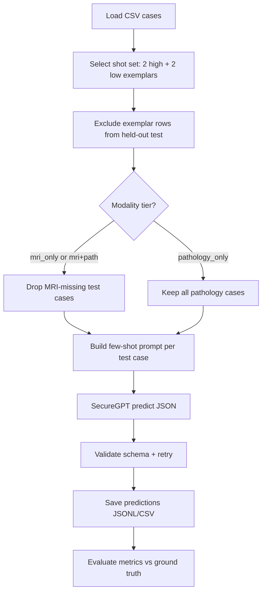
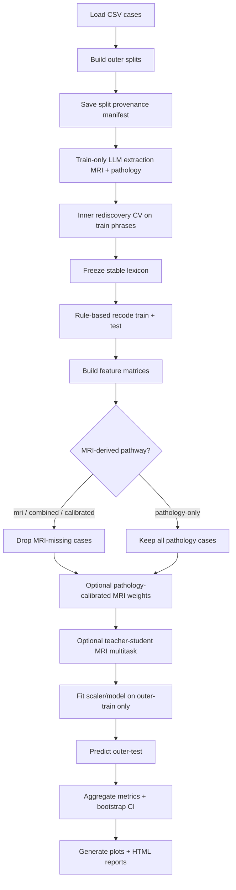

# Lexical Dispersion Evaluation Pipeline

Leakage-aware clinical NLP and machine learning pipelines for predicting breast tumor **spatial dispersiveness** and **relapse risk** from post-neoadjuvant, pre-surgery MRI and pathology report text.

Both pipelines use the Stanford Health Care AI Sandbox (GPT-5-nano Global) for LLM-based extraction or prediction, with token/cost tracking, resume/checkpoint support, and PHI-conscious design suitable for clinical research auditing.

## Pipelines at a glance

|                     | **Approach 1**                                                           | **Approach 2**                                                                  |
| ------------------- | ------------------------------------------------------------------------ | ------------------------------------------------------------------------------- |
| **Goal**            | Few-shot LLM prediction of dispersion score, high/low class, and relapse | Nested CV: lexical feature discovery → supervised ML → calibration & reports    |
| **Entry point**     | `approach1.py`                                                           | `approach2.py`                                                                  |
| **Auxiliary entry** | —                                                                        | `approach2_aux.py` (extraction), `approach2_generate_reports.py` (HTML reports) |
| **Package**         | `approach1/`                                                             | `approach2/`                                                                    |
| **Change log**      | [`approach1_progress.md`](approach1_progress.md)                         | [`approach2_progress.md`](approach2_progress.md)                                |

**Approach 1** runs a SecureGPT few-shot evaluation across shot sets and modality tiers (MRI, pathology, combined). It predicts continuous dispersion, binary high/low dispersion, and relapse status directly from report text.

### Approach 1 pipeline overview



**Approach 2** is a nested outer/inner evaluation framework. It extracts quote-grounded lexical features from MRI and pathology reports, discovers stable lexicons within training folds only, trains supervised models for dispersion regression/classification and relapse prediction, and supports pathology-informed MRI calibration, teacher–student pathways, automated reports, and fold-level parallelism.

### Approach 2 pipeline overview



<!--
#### Leakage-aware design

- Outer splits are saved with provenance manifests under `outer_splits/outer_split_NNN/`.
- LLM extraction, inner rediscovery, stable lexicon freezing, MRI–pathology reliability estimation, weighted MRI lexicons, and teacher–student training are restricted to **outer-training** cases.
- Held-out outer-test cases are recoded with frozen lexicons and predicted by models fit on outer-train only.

#### Missing MRI handling

- MRI-missing cases (empty/`NA` placeholders) are **excluded** from MRI-only, combined, pathology-calibrated MRI, and teacher–student pathways.
- Pathology-only models retain all target-eligible cases.
- Summary artifact: `mri_missing_case_summary.csv` (when the full pipeline runs).

#### Split strategy

- Default outer design: **repeated Monte Carlo** (`--outer-scheme repeated_mc`, 5× stratified 80/20 by default).
- Inner rediscovery on outer-train uses a separate repeated-MC or stratified-kfold scheme (`--rediscovery-scheme`).
- Resume fingerprints validate CSV path, split hashes, seeds, and configuration before skipping completed folds.

#### Feature stability and count normalization

- Stable features are selected when rediscovery frequency exceeds `--stability-threshold` (default 0.20).
- Optional cap per modality: `--target-stable-features-per-modality` ranks by train-only selection frequency (0 = no cap).
- MRI and pathology are **not** forced to equal feature counts.
- **Guide:** [Feature stability, selection, and ML weighting](docs/approach2_feature_stability_and_selection.md) — rediscovery, frozen encoding, and which CLI flags control feature count.

#### Cost estimation

- Pre-run: `llm_cost_estimate_apriori.json` (interactive confirmation unless `-y` / `--yes`).
- Post-run: `llm_token_cost_report.json`.

#### Parallelism

- `--parallel-fold-workers` — concurrent outer folds (isolated split directories + checkpoints).
- `--max-api-workers` — global API semaphore across folds/modalities.
- `--parallel-modality-workers`, `--ml-n-jobs` — within-fold modality and GridSearch parallelism.

- Python ≥ 3.10
- Stanford AI Sandbox API key (`SANDBOX_API_KEY`)
- Input CSV with case-level MRI/pathology report text and outcome columns (see each pipeline's expected schema) -->

## Installation

```bash
cd pipeline
python3 -m venv .venv
source .venv/bin/activate   # Windows: .venv\Scripts\activate
pip install -e ".[dev]"
```

Set credentials in a `.env` file at the project root (or pass `SANDBOX_ENV_PATH` / `--env-path` for approach 2 extraction):

```bash
SANDBOX_API_KEY=your_sandbox_key_here
NEW_SECUREGPT_API_KEY=your_securegpt_key_here
```

Model selection controls both deployment name and API key:

| `--model` | Deployment | API key env var |
|-----------|------------|-----------------|
| `gpt-5-nano` (default) | `gpt-5-nano` | `SANDBOX_API_KEY` |
| `gpt-5` | `gpt-5` | `NEW_SECUREGPT_API_KEY` |

Optional: `MAX_COMPLETION_TOKENS`, `REASONING_EFFORT`, `SANDBOX_ENV_PATH`, `ENV_PATH` (approach 1).

## Quick start

### Approach 1 — few-shot prediction

```bash
cd pipeline
export SANDBOX_API_KEY=your_key_here

# GPT-5-nano (default; uses SANDBOX_API_KEY)
python approach1.py --csv-path /path/to/cases.csv --outdir ./outputs/approach1 --model gpt-5-nano

# GPT-5 (uses NEW_SECUREGPT_API_KEY)
python approach1.py --csv-path /path/to/cases.csv --outdir ./outputs/approach1 --model gpt-5

# Non-interactive
python approach1.py --csv-path /path/to/cases.csv --outdir ./outputs/approach1 -y
```

Common flags: `--resume` / `--no-resume`, `--skip-completed-configs`, `--force-rerun-cases`, `--skip-preflight`, `--results-report-only`, `--model`, `--deployment` (alias for `--model`).

Regenerate the HTML review page without API calls:

```bash
python approach1.py --results-report-only --outdir ./outputs/approach1
```

### Approach 2 — nested lexical + ML evaluation

```bash
cd pipeline
export SANDBOX_API_KEY=your_key_here

python approach2.py \
  --csv-path /path/to/cases.csv \
  --out_dir ./outputs/approach2 \
  --model gpt-5-nano \
  --enable-pathology-calibration \
  --enable-teacher-student \
  --modalities mri path combined \
  --yes
```

Use `--regenerate-reports-only` to rebuild plots and HTML/Markdown reports from saved `nested_outer_*` artifacts without re-running extraction or model fitting.

**Resume** a partial run (skips completed outer splits when fingerprints match):

```bash
python approach2.py \
  --csv-path /path/to/cases.csv \
  --out_dir ./outputs/approach2 \
  --resume \
  --skip-completed-splits \
  --yes
```

**Generate HTML review reports** without re-running the pipeline:

```bash
python approach2_generate_reports.py \
  --run-dir ./outputs/approach2 \
  --csv-path /path/to/cases.csv \
  --force

python -m approach2.report_cli --run-dir ./outputs/approach2 --force --open
```

Regenerate flowchart PNG: `python scripts/generate_approach2_flowchart.py`

### Approach 2 — standalone extraction only

Run MRI or pathology lexical extraction without the full nested evaluator:

```bash
python approach2_aux.py \
  --csv-path /path/to/cases.csv \
  --outdir ./outputs/extractions_mri \
  --report-mode mri \
  --max-api-workers 2 \
  --yes
```

## Project layout

```
pipeline/
├── README.md
├── pyproject.toml              # onc-pipeline package (approach1 + approach2)
├── approach1.py                # thin CLI shim → approach1.cli
├── scripts/
│   ├── generate_approach1_flowchart.py
│   └── generate_approach2_flowchart.py
├── docs/
│   ├── approach1_pipeline_flowchart.mmd
│   ├── approach1_pipeline_flowchart.png
│   ├── approach2_pipeline_flowchart.mmd
│   └── approach2_pipeline_flowchart.png
├── approach1/                  # few-shot prediction package
│   ├── cli.py
│   ├── orchestration.py
│   ├── config.py, data.py, splits.py, inference.py
│   ├── api/                    # client, cost tracking
│   ├── prompts/                # system message, templates
│   ├── schema/                 # LLM JSON validation
│   ├── checkpoint/             # resume, fingerprints
│   └── evaluation/             # metrics, plots, evidence
├── approach2.py                # thin CLI shim → approach2.cli
├── approach2_generate_reports.py  # report generator shim → approach2.report_cli
├── approach2_aux.py            # thin CLI shim → approach2.extraction
├── approach2/                  # nested evaluation package
│   ├── cli.py                  # nested evaluation main()
│   ├── report_cli.py           # standalone HTML report generator
│   ├── orchestration.py        # outer-fold execution, checkpoints
│   ├── reports.py              # automated MD/HTML reports + plots
│   ├── eval_data.py, splits.py, lexicon.py, recoding.py
│   ├── audit.py, calibration.py, models_ml.py
│   ├── config.py, models.py, text_utils.py, io_atomic.py
│   ├── features/               # normalize.py, matrices.py
│   ├── evaluation/             # plots.py, metrics/stats.py
│   ├── extraction/             # LLM extraction (from approach2_aux)
│   │   ├── pipeline.py, schema.py, data.py, cli.py
│   │   └── config.py
│   ├── api/                    # client.py, cost.py
│   ├── prompts/                # extraction templates, builder
│   ├── html_report.py
│   └── logging_setup.py
└── tests/
    ├── approach1/
    └── approach2/
```

Both `approach1.py` and `approach2.py` are **compatibility shims**. New code should import from the `approach1` and `approach2` packages directly.

## Testing

```bash
cd pipeline
pytest tests/approach1/ -v
pytest tests/approach2/ -v

# or all tests
pytest tests/ -v
```

Approach 1 tests cover schema validation, prompt golden strings, split leakage, checkpoint fingerprints, and metric golden values. Approach 2 tests cover config/constants, text utilities, pure metric helpers, import smoke tests, and CLI `--help` (no live API calls).

Verify entry points without a real API key:

```bash
SANDBOX_API_KEY=dummy python approach1.py --help
SANDBOX_API_KEY=dummy python approach2.py --help
SANDBOX_API_KEY=dummy python approach2_aux.py --help
SANDBOX_API_KEY=dummy python approach2_generate_reports.py --help
```

## Outputs and logging

- **Approach 1** writes per-config predictions, evaluation plots, `token_cost_report.json`, and a consolidated **`approach1_results_report.html`** under `--outdir`.
- **Approach 2** writes nested CV artifacts under `--out_dir`, including per-split lexicons, predictions, metrics (`nested_outer_metrics_summary.csv`), and three HTML review pages:
  - `automated_results_report.html` — performance metrics, calibration/ROC/PR plots, per-fold summaries
  - `interpretability_report.html` — feature density, coefficients, stability, MRI–pathology reliability
  - `missed_case_review.html` — worst errors, false positives/negatives, failure-mode tags
  - Supporting plots in `report_plots/` and `interpretability_plots/`
  - Markdown mirrors: `automated_results_report.md`, `interpretability_report.md`, `missed_case_error_analysis.md`
- **Standalone extraction** writes per-case JSON/CSV extractions and `llm_token_cost_report.json`.

See [`approach1_progress.md`](approach1_progress.md) and [`approach2_progress.md`](approach2_progress.md) for detailed output schemas and methodology notes.

## Design principles

- **Leakage awareness** — lexicons, calibration weights, and feature discovery are fit only on outer-training data; held-out test cases receive frozen rules and models.
- **Reproducibility** — explicit seeds, split provenance manifests, checkpoint/resume layers, and versioned progress logs.
- **Modularity** — domain logic lives in installable packages; top-level scripts are thin entry points.
- **PHI consciousness** — quote-grounded extraction, secure API usage, and no real report text in unit tests.

## Further reading

- [`approach1_progress.md`](approach1_progress.md) — API migration, cost estimation, resume/checkpoint behavior, modality tiers.
- [`approach2_progress.md`](approach2_progress.md) — pathology-informed MRI calibration, relapse prediction, fold parallelism, modularization history, and deferred regression-test work.
