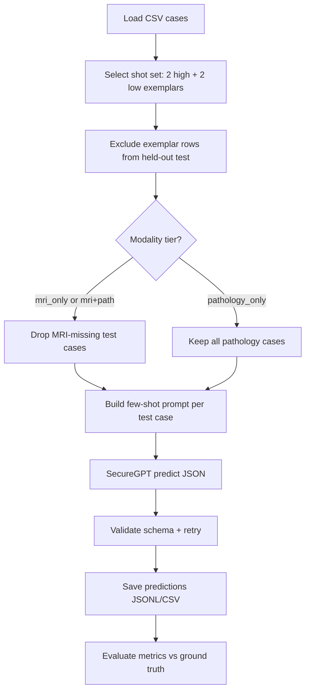

# Pipeline Update Summary

This update modernizes the clinical report LLM evaluation pipeline while preserving the original prediction, validation, output, and evaluation structure as much as possible.

## Major changes

### 1. Updated API usage

- Replaced the outdated `AzureOpenAI` client setup with the newer `requests`-based SHC Azure OpenAI API pattern.
- Updated the deployment to `gpt-5-nano` for GPT-5-nano Global usage.
- Switched authentication to use the `api-key` header rather than `Ocp-Apim-Subscription-Key`.
- Loads the API key from `SANDBOX_API_KEY`, matching the newer working example.

### 2. Added post-run token and cost tracking

The script now reads token usage from each API response and tracks cumulative usage across the full run, including:

- Total prompt/input tokens
- Cached input tokens
- Uncached input tokens
- Completion/output tokens
- Reasoning tokens, if reported by the API
- Total tokens
- Estimated total cost
- Estimated cost savings from cached tokens

Pricing assumptions are based on GPT-5-nano Global:

| Token type   | Price per 1M tokens |
| ------------ | ------------------: |
| Input        |               $0.05 |
| Cached input |               $0.01 |
| Output       |               $0.40 |

A cumulative cost report is printed and saved as `token_cost_report.json`.

### 3. Added a-priori full-pipeline cost estimation

Before running inference across all held-out cases, the script now:

1. Builds the full prompt for every test case.
2. Estimates total input-token usage before sending API calls.
3. Estimates possible output-token cost using the configured maximum completion-token budget.
4. Prints a full projected cost estimate for the pipeline.
5. Prompts the user from the command line to confirm before continuing.

A `--yes` / `-y` command-line flag was added to bypass this confirmation for non-interactive runs.

### 4. Simplified validation-token system

- Removed the previous two-token validation setup scattered throughout the prompt.
- Replaced it with a single deterministic validation token per case.
- The validation token is placed only once, at the very end of the report/prompt.
- Output validation now checks that the model returns this single expected token exactly.

### 5. Prompt structure adjusted for caching

The prompt was reorganized to place stable, repeated content earlier, including:

- Task instructions
- Strict rules
- Descriptor guide
- Output JSON schema
- Few-shot training examples

Case-specific content is placed later. This structure is intended to improve prompt-prefix caching across repeated calls and increase cached-token savings.

### 6. Preserved core pipeline behavior

The following core behavior remains unchanged:

- Same CSV-based case loading structure
- Same few-shot training-row setup
- Same held-out test-case loop
- Same JSON-only model output requirement
- Same schema/range validation logic, except for the simplified validation token
- Same prediction outputs to JSONL and CSV
- Same downstream evaluation metrics for dispersion and relapse prediction

## Output files added or modified

- `predictions_testing_cases.jsonl`: per-case prediction records
- `predictions_testing_cases.csv`: tabular prediction results
- `evaluation_metrics.txt`: downstream evaluation metrics
- `run.log`: full pipeline log
- `token_cost_report.json`: cumulative token and cost report

## Practical effect

The updated script should now run against the newer SHC Azure GPT-5-nano API endpoint, estimate cost before execution, track actual token/cost usage after each call, report cached-token savings, and use a cleaner validation-token design that avoids distributing sentinel tokens throughout the clinical prompt.

---

## Appendix: Modular refactor (2026-23-06)

The monolithic `approach1.py` (~2,500 lines) was split into the `approach1/` Python package. **Scientific behavior is unchanged**: same prompts, thresholds, shot sets, train/test splits, output filenames, metrics, and resume/checkpoint semantics. The refactor is structural only.

### What changed

| Area             | Before                                              | After                                                                |
| ---------------- | --------------------------------------------------- | -------------------------------------------------------------------- |
| Entry point      | Single `approach1.py` file                          | `approach1.py` (thin CLI) + `approach1/cli.py`                       |
| Implementation   | All logic in one file                               | Modular package (see layout below)                                   |
| API / cost state | Module-level globals (`API_KEY`, `COST_TRACKER`, …) | `SecureGPTClient` + `CostTracker` classes with backward-compat shims |
| Tests            | None in `pipeline/`                                 | `tests/approach1/` (34 unit tests)                                   |
| Dependencies     | Implicit                                            | `pyproject.toml` with pinned ranges                                  |

### Package layout

```
pipeline/
├── approach1.py              # CLI: python approach1.py ...
├── approach1/
│   ├── config.py             # Constants, SHOT_SETS, modality tiers
│   ├── models.py             # Case, RunConfig dataclasses
│   ├── data.py               # CSV loading
│   ├── splits.py             # Train/test partition, build_run_configs
│   ├── prompts/              # system.py, descriptors.py, templates.py, tokens.py
│   ├── schema/               # LLM output validation, prediction records
│   ├── api/                  # SecureGPTClient, CostTracker, cost estimation
│   ├── inference.py          # predict_case (retry + validation)
│   ├── checkpoint/           # Resume, fingerprints, JSONL/CSV I/O
│   ├── evaluation/           # Metrics, evidence attribution, plots
│   ├── orchestration.py      # run_one_config loop
│   └── cli.py                # argparse + main()
├── tests/approach1/
└── pyproject.toml
```

### What was preserved

- Few-shot held-out evaluation (not k-fold CV): 2 high + 2 low training rows per shot set; all other rows are test.
- Three modality tiers: `mri_only`, `pathology_only`, `mri_plus_pathology`.
- Default shot sets: `[0,2]` + `[101,102]` and `[0,19]` + `[82,85]`.
- Dispersion high/low cutoff at 85.
- Per-case JSONL checkpoints and per-config `COMPLETED.json` resume markers.
- All evaluation metrics, plots, and output artifact names.

### Deferred (not yet implemented)

- Verbatim evidence-quote substring validation against input reports
- PHI-safe log redaction (case IDs and API error bodies still appear in `run.log`)
- Per-case API cost fields in output artifacts
- Consolidating the duplicate copy at `sabcs/approach1-3.py`

---

## Future usage guide

### Quick start (CLI)

```bash
cd pipeline
python3 -m venv .venv && source .venv/bin/activate
pip install -e ".[dev]"

python approach1.py \
  --csv-path /path/to/PROCESSED_TRIMMED_path_cases_MRI_status.csv \
  --outdir ./securegpt_dispersion_outputs \
  --env-path /path/to/.env \
  -y
```

Common flags:

| Flag                          | Purpose                                                |
| ----------------------------- | ------------------------------------------------------ |
| `-y` / `--yes`                | Skip interactive cost confirmation                     |
| `--skip-preflight`            | Skip initial API connectivity test                     |
| `--no-resume`                 | Ignore existing checkpoints; start fresh               |
| `--force-rerun-cases`         | Re-call API for all test cases (even if JSONL exists)  |
| `--no-skip-completed-configs` | Re-evaluate configs even when `COMPLETED.json` matches |

### Environment

- `.env` must contain `SANDBOX_API_KEY` (see `pipeline/.gitignore`; never commit secrets).
- Optional: `ENV_PATH` env var overrides default `.env` location.
- Optional: `REASONING_EFFORT` env var (currently unused in payload; reserved).

### Programmatic imports

The full original API is available via the package:

```python
from approach1 import (
    Case,
    RunConfig,
    load_cases,
    build_run_configs,
    build_user_prompt,
    predict_case,
    evaluate_and_plot,
    run_one_config,
)
```

For targeted edits, import from submodules directly (preferred for agents and unit tests):

```python
from approach1.prompts.templates import build_user_prompt
from approach1.schema.prediction import validate_prediction_obj
from approach1.splits import build_run_configs
```

### Output directory structure

```
<outdir>/
├── run.log
├── all_tiers_metrics_summary.csv
└── <shotset_name>/
    └── <modality>/
        ├── run_config.json
        ├── predictions_testing_cases.jsonl
        ├── predictions_testing_cases.csv
        ├── evaluation_metrics_summary.json
        ├── evaluation_metrics_from_csv.txt
        ├── token_cost_report.json
        ├── skipped_cases_missing_mri.csv   # MRI tiers only, if applicable
        └── _resume_checkpoint/COMPLETED.json
```

Re-run the same `--outdir` to resume interrupted work (default). Completed shotset/modality folders are skipped when the checkpoint fingerprint matches.

### Running tests

```bash
cd pipeline
source .venv/bin/activate
pytest tests/approach1/ -v
```

Tests cover prompt determinism, schema validation, train/test leakage guards, checkpoint fingerprints, and metric computation on synthetic data. They do **not** call the live API.

### Where to edit what

| Task                           | Module                                                          |
| ------------------------------ | --------------------------------------------------------------- |
| Change shot sets or thresholds | `approach1/config.py`                                           |
| Edit prompt text               | `approach1/prompts/system.py`, `descriptors.py`, `templates.py` |
| Change LLM output rules        | `approach1/schema/prediction.py`                                |
| Modify API client / retries    | `approach1/api/client.py`, `approach1/inference.py`             |
| Adjust metrics or plots        | `approach1/evaluation/metrics.py`, `plots.py`, `runner.py`      |
| Change resume behavior         | `approach1/checkpoint/`                                         |
| Add CLI flags                  | `approach1/cli.py`                                              |

**Important:** Prompt and schema changes can alter LLM outputs and invalidate existing checkpoints. After editing prompts, use `--force-rerun-cases` or a new `--outdir`. Consider bumping `RESUME_SCRIPT_VERSION` in `config.py` if fingerprint semantics change.

### Regression safety

Before merging scientific changes:

1. Run `pytest tests/approach1/ -v`.
2. Re-run evaluation only on a frozen prediction CSV and diff `evaluation_metrics_summary.json`.
3. For prompt edits, compare golden prompt hashes in `tests/approach1/test_prompts_golden.py`.

### Note on `sabcs/approach1-3.py`

A byte-identical copy of the pre-refactor monolith may still exist under `sabcs/`. **Use `pipeline/approach1.py` or `import approach1` from the `pipeline/` directory** as the canonical entry point. The `sabcs/` copy should be updated or removed in a follow-up to avoid drift.

---

## Comprehensive audit and hardening (2026-06-23)

A full review compared the refactored `pipeline/approach1/` package against `sabcs/approach1-3.py` and the intended research workflow.

### Audit conclusion

The refactored implementation is **functionally equivalent** to `approach1-3.py` for core behavior: CSV loading, 2+2 few-shot shot sets, three modality tiers, held-out evaluation, JSON schema validation with retries, cost tracking, resume/checkpoints, and evaluation metrics/plots. No major regressions were found in the execution path.

**Intentional design notes (not bugs):**

- Shot sets use **2 high + 2 low** exemplar rows (4 total), not 3+3.
- Few-shot exemplars originally included only `dispersion_score_true` and `relapse_true`; explicit high/low labels were added in the prompt-labeling update below.
- Verbatim evidence quotes are required in the prompt but **not** programmatically validated as substrings of input reports (same as the monolith).
- Per-case API cost is not saved; only aggregate `token_cost_report.json` per config.

### Missing MRI handling fix

`has_report_text` and `safe_text` were hardened:

- `pd.NA` / `numpy.nan` now normalize to empty text.
- Placeholder strings such as `missing`, `<na>`, `not available` are treated as absent MRI/pathology text.

MRI-missing held-out cases are skipped for `mri_only` and `mri_plus_pathology` but remain eligible for `pathology_only`. Tests: `tests/approach1/test_missing_mri.py`.

### Pipeline flowchart documentation

A simplified top-down flowchart (matching the Approach 2 Mermaid style) documents the workflow:

- Mermaid source: `docs/approach1_pipeline_flowchart.mmd`
- PNG generator: `scripts/generate_approach1_flowchart.py`
- Rendered image: `docs/approach1_pipeline_flowchart.png`



### Few-shot exemplar label annotations

Training exemplars in the user prompt now include **all ground-truth labels** needed for in-context learning:

| Field | Description |
| ----- | ----------- |
| `exemplar_dispersion_band` | `high dispersion` or `low dispersion` (from shot-set row assignment) |
| `dispersion_score_true` | Numeric ground-truth dispersion score |
| `dispersion_high_low_true` | `0` or `1` using cutoff >= 85 |
| `relapse_true` | `0` or `1` with inline legend |

`RESUME_SCRIPT_VERSION` bumped to `approach1-3-v2` so prior checkpoints are invalidated after this prompt change.

### Temperature parameter

- **API default when omitted:** typically `1.0` (high sampling randomness).
- **Pipeline default:** `TEMPERATURE=0` (env or `--temperature`) for deterministic JSON-only outputs.
- Temperature is sent in every chat completion payload, logged at startup, and stored in resume fingerprints.

Use **low temperature (0–0.2)** for production runs; raise only for exploratory ablations.

### HTML results review report

A consolidated, self-contained HTML report is generated at the end of each full pipeline run:

- **Output:** `<outdir>/approach1_results_report.html`
- **Regenerate only:** `python approach1.py --results-report-only --outdir <path>`

The report is intended for readers unfamiliar with the codebase. It includes:

1. **Overview** — what Approach 1 does and how to read the report.
2. **Aggregate metrics** — `all_tiers_metrics_summary.csv` as a table.
3. **Per shot-set / modality sections** — each with:
   - Run configuration (training rows, test count, skipped MRI cases)
   - Headline metric cards (MAE, RMSE, Spearman, accuracy, F1, needle retrieval)
   - Relapse predictor comparison table
   - Token/cost summary
   - All diagnostic PNG plots with captions
   - Per-case prediction preview (truncated reasoning)
   - Evidence attribution CSV previews
   - Full text metrics report
4. **Metric glossary** — from `evaluation_explanation.txt` content.

Implementation: `approach1/evaluation/html_report.py` (styling helpers) and `approach1/evaluation/results_report.py` (artifact scanner and builder). Tests: `tests/approach1/test_results_report.py`.

### Cost estimation (verified behavior)

| Stage | Behavior |
| ----- | -------- |
| A-priori | Builds real `build_user_prompt` per test case; estimates tokens via tiktoken; separate input/output; cached-token heuristic from common prompt prefix |
| Post-run | Uses API `usage` fields including `cached_tokens` and `reasoning_tokens` |
| Retries | Each API call accumulates cost (including failed validation retries) |
| Prices | Hardcoded in `config.py` (`PRICE_PER_1M_*`) |

### Test coverage (current)

```bash
pytest tests/approach1/ -v   # 34 tests: schema, prompts, splits, metrics, MRI handling, HTML report
```

### Updated output directory structure

```
<outdir>/
├── run.log
├── all_tiers_metrics_summary.csv
├── approach1_results_report.html          # NEW: consolidated HTML review
└── <shotset_name>/
    └── <modality>/
        ├── run_config.json
        ├── predictions_testing_cases.jsonl
        ├── predictions_testing_cases.csv
        ├── evaluation_metrics_summary.json
        ├── evaluation_metrics_from_csv.txt
        ├── evaluation_explanation.txt
        ├── token_cost_report.json
        ├── skipped_cases_missing_mri.csv   # MRI tiers only, if applicable
        ├── *.png                           # diagnostic plots
        ├── evidence_attribution_*.csv
        └── _resume_checkpoint/COMPLETED.json
```

### Updated CLI flags

| Flag | Purpose |
| ---- | ------- |
| `--temperature` | Sampling temperature (default `0`) |
| `--results-report-only` | Build HTML report from existing artifacts; no API calls |

### Where to edit (additions)

| Task | Module |
| ---- | ------ |
| HTML report layout / captions | `approach1/evaluation/html_report.py`, `results_report.py` |
| Flowchart | `docs/approach1_pipeline_flowchart.mmd`, `scripts/generate_approach1_flowchart.py` |
| Few-shot label text | `approach1/prompts/templates.py` |
| Temperature default | `approach1/config.py`, `approach1/api/client.py` |
