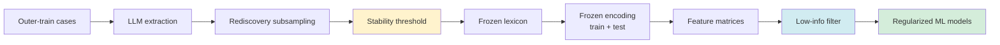

# Approach 2: Feature stability, selection, and ML weighting

This guide explains how **Approach 2** decides which clinical-text features survive from LLM extraction through to classical ML models. It is written for readers who are new to the codebase or to machine-learning feature-selection concepts.

**Scope:** Approach 2 only (`pipeline/approach2/`). Approach 1 uses few-shot LLM prediction and does not use rediscovery or stability filtering.

**Related code:** `approach2/lexicon.py`, `approach2/recoding.py`, `approach2/models.py`, `approach2/models_ml.py`, `approach2/cli.py`.

---

## Big picture: four stages

Approach 2 does **not** let the ML model choose features directly from raw report text. Instead, features pass through several gates:



| Stage | What happens | Can ML recover dropped features? |
|-------|----------------|----------------------------------|
| **1. LLM extraction** | Model reads reports and proposes phrases / concept groups | No — only on outer-**train** cases |
| **2. Rediscovery + stability** | Phrases must reappear across train subsamples | **No — hard gate** |
| **3. Frozen encoding** | Reports converted to numeric columns via lexicon | Only if the phrase/group was kept in stage 2 |
| **4. ML fitting** | Models down-weight or ignore unhelpful **existing** columns | Yes — among columns that exist |

The most important distinction:

- **Stability filtering** decides which features **exist** in the dataset.
- **ML regularization** decides which existing features **matter** for prediction.

---

## Stage 1: LLM feature discovery (outer-train only)

For each outer cross-validation split, the pipeline:

1. Holds out an outer-**test** set (default: 20% of cases per repeat).
2. Calls the LLM on outer-**train** cases only to extract candidate phrases and map them to biological concept groups (MRI and/or pathology).

**Why train-only?** Feeding test reports into discovery would leak information about the held-out set into feature definitions. Test cases are never LLM-extracted in the main evaluation path.

**Outputs to inspect:**

- `{split_id}_train_extractions_{mode}.csv` — raw LLM records per train case
- Phrase tables derived from those extractions

---

## Stage 2: Rediscovery and the stability threshold

### What is rediscovery?

After extraction, the pipeline asks a robustness question:

> If I repeatedly subsample the outer-train set, does this phrase (or concept group) keep showing up?

It builds many **rediscovery subsplits** on outer-train (default: **25** repeated Monte Carlo draws). For each subsplit:

1. A random train subset is drawn (same scheme as `--rediscovery-scheme`, default `repeated_mc`).
2. For each candidate phrase, count how many **distinct train cases** in that subset contain it.
3. If that count is ≥ `--min-phrase-cases` (default **2**), the phrase is **selected** in that subsplit.
4. The same logic applies to concept groups with `--min-group-cases` (default **2**).

### Selection frequency

For each phrase or group:

```
selection_frequency = selected_count / n_rediscovery_subsplits
```

Example with 25 subsplits:

| `selection_frequency` | Meaning |
|----------------------|---------|
| 1.00 | Selected in all 25 subsplits |
| 0.60 | Selected in 15 of 25 |
| **0.20** | Selected in **5 of 25** (current default threshold) |
| 0.12 | Selected in 3 of 25 |

### Stability threshold (`--stability-threshold`)

**Default: `0.20`** (defined in `approach2/config.py` as `DEFAULT_STABILITY_THRESHOLD`).

A feature is marked **stable** and enters the **frozen lexicon** if:

```
selection_frequency >= stability_threshold
```

Stable phrases and groups are saved per outer split and modality, for example:

- `{split_id}_phrase_rediscovery_frequency_{mode}.csv` — all candidates with frequencies
- `{split_id}_stable_phrase_lexicon_{mode}.csv` — survivors only
- `{split_id}_stable_lexicon_metadata_{mode}.json` — threshold and counts

**Lowering the threshold** (e.g. 0.35 → 0.20 → 0.15) keeps more phrases. **Raising it** keeps only the most reproducible extractions.

Historical defaults for context: **0.60** (original, strict) → **0.35** (more permissive) → **0.20** (current, retains more signal).

---

## Stage 3: Frozen encoding (train and test)

Once the lexicon is frozen for an outer split, **every** case in that split (train and test) is recoded into numeric features **without** calling the LLM again.

### Phrase features (strict matching)

For each stable phrase, the pipeline checks whether the normalized report text contains the **exact normalized quote** (`quote_norm`) via substring search.

- Match → feature is present (with negation/uncertainty judged in a small context window).
- No match → feature stays zero.

**Implication:** A clinically relevant finding on a test case will **not** be captured if:

- The phrase was unstable and dropped in stage 2, or
- The test report uses different wording than the frozen quote.

### Group / ontology features (broader matching)

Concept groups can also be detected via fixed regex patterns in `SHARED_CONCEPT_ONTOLOGY` (`approach2/config.py`). With default `--ontology-groups-mode stable_plus_ontology`, recoding includes stable groups **plus** the full ontology pattern set — a separate channel that is broader than phrase substring matching.

### Feature representations (`--representations`)

The same underlying recoding can be exposed to ML in different shapes:

| Representation | What the model sees |
|----------------|---------------------|
| `phrase_binary` | 0/1: stable phrase present or not |
| `group_binary` | 0/1: concept group present |
| `group_count` | Count of regex hits per group |
| `group_status` | Present + negated + uncertain counts |
| `weighted_concept_score` | Pathology-calibrated MRI concept weights (optional pathway) |
| `weighted_plus_group_status` | Weighted scores plus group status columns |

Default run evaluates multiple representations so models can be compared on the same discovered lexicon.

### Modalities (`--modalities`)

| Modality | Feature source |
|----------|----------------|
| `mri` | MRI report recoding |
| `path` | Pathology report recoding |
| `combined` | Early fusion of MRI + pathology columns |

MRI-missing cases are excluded from MRI-only, combined, calibrated-MRI, and teacher–student pathways but retained for pathology-only models.

---

## Stage 4: ML-side filtering and weighting

After frozen encoding, sklearn pipelines in `approach2/models_ml.py` fit models on the numeric matrices.

### Step A: Low-information feature filter

Every standard model pipeline starts with `LowInfoFeatureFilter` (`approach2/models.py`). On **training data only**, it drops columns that are effectively unusable:

| Rule | Default | Purpose |
|------|---------|---------|
| `min_non_missing` | 2 | Need at least 2 non-missing values |
| `min_nonzero` | 1 | Need at least 1 non-zero entry |
| `min_unique_non_missing` | 2 | Need variation (not constant) |

If every column would be removed, the filter keeps all columns (fallback so the pipeline does not crash).

This is a **soft, ML-stage** prune: it removes columns with no signal or no variation, not columns that are merely weakly associated with the outcome.

### Step B: Scaling

`StandardScaler` centers and scales each remaining column before model fitting.

### Step C: Regularized models and hyperparameter search

Models are fit with `GridSearchCV` over regularization strength (and related hyperparameters). Examples:

| Model key | Task | How it handles many features |
|-----------|------|------------------------------|
| `ridge_logistic` | Classification | L2 penalty shrinks coefficients toward zero |
| `elasticnet_logistic` | Classification | L1 + L2; can drive some coefficients to exactly zero |
| `linear_svm` | Classification | Margin-based linear separator with C penalty |
| `ridge_regression` | Regression | L2 shrinkage |
| `elasticnet_regression` | Regression | Sparse + shrinkage |
| `pls_regression` | Regression | Low-rank projection when features are correlated |
| `linear_svr` / `huber_regression` | Regression | Robust / margin-based alternatives |

**Class imbalance:** classification models use `class_weight="balanced"` where applicable.

**Interpretation:** larger |coefficient| (after scaling) generally means stronger association with the outcome in the training fold, subject to regularization and correlation between features.

Coefficient summaries are written to artifacts such as `nested_outer_feature_coefficients_all.csv`.

---

## Parameter reference: tuning how many features survive

### Primary knobs (discovery stage)

These control the frozen lexicon **before** ML sees any matrix.

| CLI flag | Default | Effect |
|----------|---------|--------|
| `--stability-threshold` | **0.20** | Minimum rediscovery frequency to keep a phrase/group. **Main lever** for feature count. |
| `--min-phrase-cases` | 2 | Cases required in a subsplit for a phrase to count as “selected” there. Lower = noisier. |
| `--min-group-cases` | 2 | Same for concept groups. |
| `--rediscovery-repeats` | 25 | Number of subsplits used to estimate frequency. More repeats = smoother estimates, not more features by itself. |
| `--rediscovery-scheme` | `repeated_mc` | How subsplits are drawn (`repeated_mc` or `stratified_kfold`). |
| `--rediscovery-test-frac` | 0.20 | Held-out fraction inside each rediscovery MC draw (when scheme is `repeated_mc`). |
| `--rediscovery-folds` | 5 | Folds when `--rediscovery-scheme stratified_kfold`. |
| `--target-stable-features-per-modality` | 0 | After stability, cap to top-K phrases by frequency (**0 = no cap**). Use only if you have hundreds of stable phrases and want a hard limit. |
| `--ontology-groups-mode` | `stable_plus_ontology` | `stable_only` = fewer group features; `stable_plus_ontology` = adds fixed ontology regex groups (recommended for coverage). |

### Secondary knobs (encoding richness, not stability count)

| CLI flag | Default | Effect |
|----------|---------|--------|
| `--representations` | group_binary, group_count, group_status, phrase_binary | Which matrix views are built and evaluated. |
| `--modalities` | mri, path, combined | Which report types contribute features. |
| `--weighted-lexicon-min-selection-frequency` | 0.0 | Floor for pathology-calibrated MRI weighting (weighted representations only). |
| `--weight-stability-power` | 0.5 | How strongly rediscovery frequency affects MRI concept weights (calibration pathway). |

### Not feature-selection parameters (common confusion)

| Flag | Role |
|------|------|
| `--outer-repeats` / `--outer-folds` | Outer CV design for **evaluation**, not rediscovery subsample count. |
| `--stability-threshold` vs `--weighted-lexicon-min-selection-frequency` | First gates the frozen lexicon; second only affects weighted MRI scores. |

---

## Does stability filtering still matter if ML regularizes?

**Yes — but for a different reason than ML regularization.**

### What ML regularization is good at

- Many **encoded** columns relative to sample size
- Correlated features
- Weak or irrelevant columns that still made it into the matrix

Elastic net and ridge can shrink coefficients and (for elastic net) zero some out. That is **predictive** feature selection.

### What ML regularization cannot fix

1. **Features never encoded** — If stability filtering dropped a phrase, there is no column for the model to use on train or test.
2. **Test-time wording mismatch** — Test cases are not LLM-extracted; they only match frozen quotes. Unstable phrases are unmatchable on test.
3. **LLM inconsistency** — Unstable phrases are often one-off extractions or inconsistent wording. Keeping all of them adds poorly defined columns.
4. **Very small training sets** — Outer-train may be only ~50–150 cases. Extreme sparsity (hundreds of 0/1 columns, few positives each) makes estimates unstable even with regularization.

### Practical split of responsibilities

| Question | Answered by |
|----------|-------------|
| “Did this LLM extraction reproduce across train subsamples?” | **Stability threshold** |
| “Can we detect this in the report text at encoding time?” | **Frozen encoding rules** |
| “Among encoded columns, which help predict the outcome?” | **ML regularization + CV** |

---

## Recommended tuning strategy

### If you worry about dropping too many features

1. **Use `--stability-threshold 0.20`** (current default) or try **0.15** in a sensitivity run.
2. **Keep `--target-stable-features-per-modality 0`** (no cap).
3. **Keep `--min-phrase-cases 2` and `--min-group-cases 2`** — do not lower to 1 unless you accept more noise.
4. **Keep `--ontology-groups-mode stable_plus_ontology`** for broader group coverage.
5. **Inspect artifacts** after a run (see below).
6. **Run a threshold sweep** — same data, thresholds e.g. 0.15 / 0.20 / 0.35 — and compare stable phrase counts and nested metrics. This is the most honest way to see if the gate is load-bearing.

### If you worry about too much noise

1. **Raise `--stability-threshold`** (e.g. 0.35 or 0.60).
2. Consider **`--target-stable-features-per-modality`** to cap interpretability-focused runs.
3. Prefer **group-based representations** for robustness; phrase_binary is the strictest channel.
4. Rely on **elastic net** models for sparsity among surviving columns.

### What not to do

- **Do not set stability to 0** — that keeps any phrase selected in a single subsplit.
- **Do not assume ML will “figure out” missing phrases** — dropped phrases are absent from the matrix entirely.
- **Do not change rediscovery and stability settings without invalidating resume checkpoints** — fingerprint includes `stability_threshold`; use `--no-skip-completed-splits` or a fresh `--out_dir` when comparing thresholds fairly.

---

## Artifacts for auditing feature survival

After a full Approach 2 run under `outer_splits/<split_id>/`:

| File | Use |
|------|-----|
| `*_phrase_rediscovery_frequency_*.csv` | All candidates with `selection_frequency` and `stable` flag |
| `*_stable_phrase_lexicon_*.csv` | Final phrase features used for encoding |
| `*_stable_group_lexicon_*.csv` | Final group features |
| `*_stable_lexicon_metadata_*.json` | Threshold, counts, optional cap metadata |
| `*_phrase_feature_matrix_*.csv` | Case × feature matrix after encoding |
| `stable_phrase_lexicon_outer_summary.csv` | Aggregate stable phrases across outer splits |
| `all_outer_phrase_rediscovery_frequencies.csv` | Pooled rediscovery stats |
| `nested_outer_feature_coefficients_all.csv` | ML model coefficients (post-regularization) |

**Quick sanity checks:**

- How many stable phrases per split/modality? (metadata JSON)
- How many phrases sit just below threshold? (frequency CSV, filter `selection_frequency` between 0.15 and 0.20)
- Are test cases mostly zeros in phrase columns? (may indicate wording mismatch, not just stability)

---

## Example: stability threshold 0.20 with defaults

With `--rediscovery-repeats 25`, `--min-phrase-cases 2`, `--stability-threshold 0.20`:

- A phrase must be selected in **at least 5 of 25** subsplits.
- In each of those subsplits, it must appear in **≥ 2** train cases.

That is more permissive than 0.35 (≥ 9 subsplits) or 0.60 (≥ 15 subsplits), while still requiring repeated evidence — not a single accidental extraction.

---

## Glossary

| Term | Meaning |
|------|---------|
| **Outer split** | Train/test partition for nested CV evaluation (default 5× 80/20 MC). |
| **Rediscovery subsplit** | Inner train subsample used only to score phrase robustness. |
| **Frozen lexicon** | Stable phrases/groups fixed for one outer split before encoding. |
| **Selection frequency** | Fraction of rediscovery subsplits where a feature met minimum case support. |
| **Stable feature** | Feature with selection frequency ≥ stability threshold. |
| **Frozen encoding** | Converting reports to numeric features using the frozen lexicon (no LLM on test). |
| **Representation** | How encoded values are packaged for ML (binary, count, status, weighted). |
| **Regularization** | Penalty that shrinks ML coefficients to reduce overfitting. |

---

## Further reading in this repo

- `pipeline/README.md` — install, CLI entry points, high-level Approach 2 flow
- `pipeline/approach2_progress.md` — implementation history, MRI handling, resume fingerprints
- `pipeline/docs/approach2_pipeline_flowchart.mmd` — end-to-end pipeline diagram
